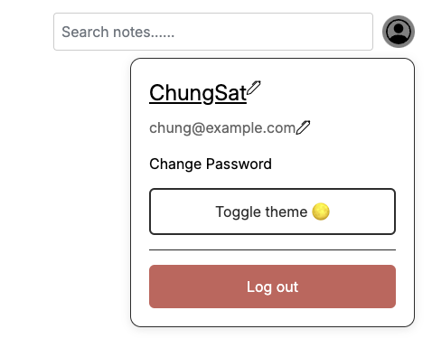

# Operation Guide

## Login


To login,
1. Enter both your email and password.
2. Click "Login". (Send POST request `/api/login`)

## Case
### Vaild input
Using correct credentials to log in

| email | password |
| --- | --- |
| chung@example.com | 1234567890 |

Result: User successfully authenticated and will be redirected to the home page

Test using CURL

```text
curl -X POST http://your-api-url/api/login \
-H "Content-Type: application/json" \
-d '{"userEmail": "your_email@example.com", "userPassword": "your_password"}'
```

### Invalid input
Using incorrect credentials to log in / wrong email format

Result: Error message will be displayed


## Signup


To sign up,
1. Enter your email, password, and the confirm password to double check the password.
2. Click "Sign up". (Send POST request `/api/signup`)
3. If the password matched and the user name is available, the system will save the registered user information to the database
4. Redirect to the home page

## Case
### Vaild input

| field            | value                |
|------------------|----------------------|
| Username         | Chiaki Morisawa      |
| Email            | morisawa@example.com |
| Password         | morisawa123          |
| Confirm Password | morisawa123          |

Result: User is successfully registered and will be redirected to the home page

### Invalid input
Username or email already exists / password does not match / Missing any field


Result: Error message will be displayed

```text
curl -X POST http://your-api-url/api/login \
-H "Content-Type: applicationcurl -X POST <url>/api/register \
-H "Content-Type: application/json" \
-d '{"userName": "your_username", "userEmail": "your_email@example.com", "userPassword": "your_password"}'/json" \
-d '{"userEmail": "your_email@example.com", "userPassword": "your_password"}'
```

### Google OAuth

Uses post request `/auth/google` to login / register with Google OAuth

To sign in / sign up with Google OAuth,
1. Click either "Continue with Google" or "Register with Google", depending on which page you are in
2. Choose the account / Login to your Google account
3. Authorize the application to fetch your information

If authentication is successful, the system will redirect to the home page.
If failed to authenticate, the system will redirect to the login page

# Home
## Create note


To create a note,
1. Click the "Create Note" Input box
2. Write something in the input box
3. Click the "Create" button (Send POST request `/api/note`))
4. Wait the server to acknowledge and display a new card with the written content onto the page

Test using CURL
```text
curl -X POST http://your-api-url/api/notes \
-H "Content-Type: application/json" \
-d '{"content": "Your note content here"}'
```

## Edit note

To edit a note,
1. Click on the content on the note card
2. Edit the content by typing it, changes will be saved automatically (Send PUT request `/api/note/:id`) with interval of 5 seconds when focus
3. When the content lost focus, the changes will be saved to the database

Test using CURL
```text
curl -X PUT http://your-api-url/api/notes/your_note_uuid \
-H "Content-Type: application/json" \
-d '{"content": "Updated note content here"}'
```

## Delete note
To delete a note,
1. On the note that would like to delete, click the "Delete" icon button
2. Click "Delete" to confirm the deletion
3. Send DELETE request `/api/note/:id` to server to execute the delete action
4. When the action is completed, the note will be removed from the page

Test using CURL
```text
curl -X DELETE http://your-api-url/api/notes/your_note_uuid \
-H "Content-Type: application/json"
```

## Search note
To search for a note,
1. Click the "Search" Input box
2. Write something in the input box
3. The POST request `/api/search` will be sent along with the keyword to the server when user stop typing
4. Wait the server to acknowledge and query the result

If result is found, the system will display the result on the page
If result is not found, the system will display a message that there are no matching results
If the keyword is empty, the page will show all the note entry

Test using CURL
```text
curl -X POST http://your-api-url/api/searchNotes \
-H "Content-Type: application/json" \
-d '{"keyword": "your_search_keyword"}'
```

## Logout



To logout,
1. Click the avatar icon
2. Click "Logout" on the flyout menu (Send GET request `/logout`)
3. Redirect to the login page

## Change username

To change the username,
1. Click the avatar icon
2. Click the edit icon next to the username on the flyout menu
3. Enter the new username
4. Click "Save" (Send PUT request `/api/updateUsername`)

Test using CURL
```text
curl -X PUT http://your-api-url/api/updateUsername \
-H "Content-Type: application/json" \
-d '{"newUserName": "your_new_username"}'
```


## Change email address

> [!NOTE]
> This feature is not available for Google OAuth users

To change the email address,
1. Click the avatar icon
2. Click the edit icon next to the email address on the flyout menu
3. Enter the new email address
4. Click "Save" (Send PUT request `/api/updateEmail`)

If the update is acknowledged, the flyout will update the information accordingly.

Test using CURL
```text
curl -X PUT http://your-api-url/api/updateEmail \
-H "Content-Type: application/json" \
-d '{"newEmail": "your_new_email@example.com"}'
```

## Change password

> [!NOTE]
> This feature is not available for Google OAuth users

To change the password,
1. Click the avatar icon
2. Click "Change Password" on the flyout menu
3. Enter the new password along with your current password
4. Click "Save" (Send PUT request `/api/updatePassword`)

Test using CURL
```text
curl -X PUT http://your-api-url/api/updatePassword \
-H "Content-Type: application/json" \
-d '{"currentPassword": "your_current_password", "newPassword": "your_new_password", "confirmPassword": "your_new_password"}'
```


